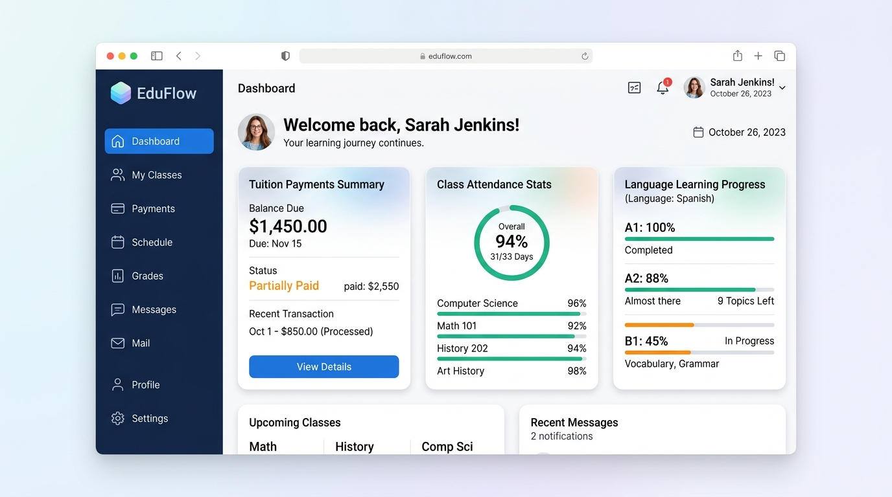
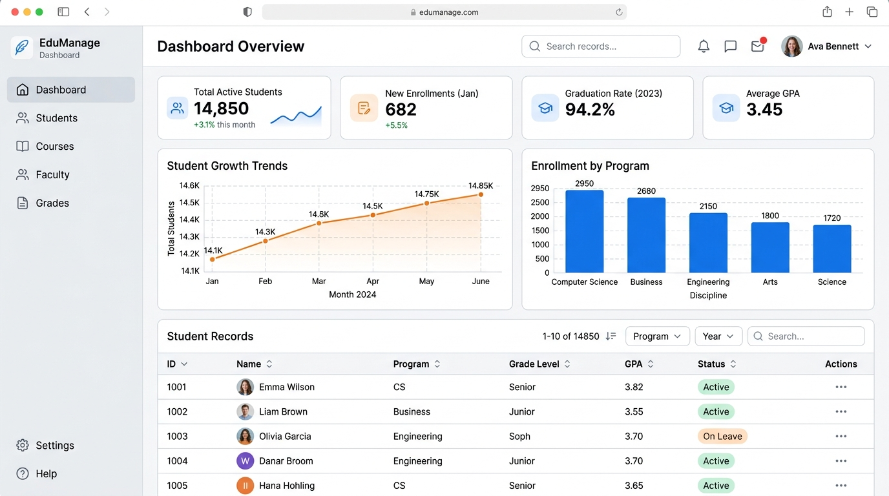

# Konsep Desain UI / Wireframe Sistem Maxima

Berdasarkan keseluruhan dokumen PRD yang telah kita susun dari Modul 1 hingga Modul 5, berikut adalah representasi visual (UI Mockup) tingkat tinggi (*high-fidelity*) dari sistem tersebut.

Mockup ini bisa kamu gunakan untuk dipresentasikan ke klien agar mereka punya "bayangan" nyata tentang bagaimana bentuk sistemnya nanti sebelum tim *developer* mulai *coding*.

---

## 1. Portal Siswa (Modul 5: POV Siswa)

Sesuai dengan PRD **Modul 5**, halaman ini difokuskan pada kemandirian siswa. 
Ketika siswa *login*, mereka tidak akan disuguhkan menu yang rumit. Di layar utama (Dashboard), sistem langsung menyajikan 3 informasi paling krusial bagi siswa:
1. **Tuition Summary (Ringkasan Tagihan):** Berapa sisa yang harus dibayar dan jadwal jatuh tempo.
2. **Attendance Stats (Statistik Kehadiran):** Memastikan absensi mereka aman.
3. **Language Progress (Progres Belajar):** Indikator sejauh mana kelulusan target level bahasa (A1, A2, B1).

---

## 2. Dashboard Manajemen (Marketing & Akademik)

Sesuai dengan PRD **Modul 1 (Kepala Marketing)** dan **Modul 3 (Kepala Akademik)**, halaman pimpinan/manajemen difokuskan pada analitik (angka).
Fitur utama layar ini:
1. **Metrik Utama (Top Cards):** Menampilkan Total Siswa Aktif, Pendaftar Baru, dll.
2. **Grafik Analitik:** Menampilkan Tren Pertumbuhan Siswa dari waktu ke waktu dan Distribusi Siswa berdasarkan Program/Cabang.
3. **Tabel Database (CRUD):** *Database* lengkap di bagian bawah layar untuk memantau status masing-masing siswa dan melakukan *action* spesifik (seperti input nilai atau *approve* dokumen).

